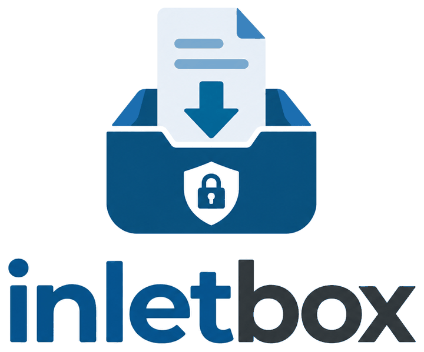

<p align="center">
  
</p>

<p align="center">
  <b>A private, self-hosted file drop box.</b><br>
  Your clients upload. Only you can download.
</p>

<p align="center">
  <a href="https://github.com/pan-dolina/inletbox/releases"></a>
  <a href="LICENSE"></a>
  
</p>

---

You create a case and generate an upload link for a client. They open the link, drop their
files in the browser or send them with `curl`, and see only what **they** uploaded through
that link. **They cannot download anything.** The files come to you.

inletbox is not a file-sharing service or a network drive. Nobody signs up, nothing is
previewed, and there are no public download links.

## Why inletbox

- **One-way by design.** A link can only upload. No server route returns file contents to
  a link holder, so a leaked link cannot be used to download your data.
- **Nothing to install for your clients.** No account and no app: a link and a browser are
  enough. Command-line users get ready-made `curl` commands on the same page.
- **Large files work.** Uploads resume after a dropped connection, in the browser and from
  the command line, so multi-gigabyte uploads survive an unreliable network.
- **You run it.** One container and one volume. Files stay on your disk or in your own
  S3/MinIO bucket. There is no telemetry and nothing is loaded from a CDN.
- **Built for teams.** Administrators see every case. Users see only the cases they are
  assigned to.
- **Secure by default.** It has two-factor login, rate limiting and a strict CSP, keeps
  tokens out of logs, and records an audit trail of every action.

## Features

| | |
|---|---|
| **Uploads** | Drag and drop in the browser; `curl -T`; a resumable shell script; resumable uploads ([tus](https://tus.io)) on both storage backends |
| **Links** | One link per recipient, each with its own expiry, revocation, maximum file size, file count and total quota; quotas hold under concurrent uploads |
| **Accounts** | `admin` and `user` roles, users assigned per case, generated temporary passwords, disable or delete accounts |
| **Sign-in** | Passwords hashed with scrypt; TOTP second factor with recovery codes, can be required for everyone |
| **Storage** | Local disk or any S3-compatible bucket (AWS, MinIO, …); incomplete uploads and orphaned files cleaned up automatically |
| **Audit** | Logins, link activity, uploads, downloads and deletions are logged with the client IP |
| **Interface** | All 24 official EU languages, light and dark theme, your own name, logo and colours |
| **Footprint** | Node.js + SQLite, no native modules, no external database |

## Quick start

```bash
git clone https://github.com/pan-dolina/inletbox.git && cd inletbox
cp .env.example .env              # set PUBLIC_URL, e.g. https://drop.example.com
docker compose up -d --build
docker compose exec app node dist/cli.js create-admin admin
```

Open `PUBLIC_URL/admin`, sign in and turn on two-factor authentication under
**Security**. The app listens on `127.0.0.1:3000`; put a reverse proxy in front of it for
TLS. The proxy settings matter for large uploads; they are in
[docs/reverse-proxy.md](docs/reverse-proxy.md).

## How a client uploads

From the browser: open the link and drop the files in.

From the terminal (the link page shows these commands, filled in):

```bash
curl --fail-with-body -H "Authorization: Bearer $TOKEN" -T report.pdf https://drop.example.com/api/upload/
```

For large files, use the resumable script, which the link page also offers for download:

```bash
INLETBOX_TOKEN="$TOKEN" ./inletbox-upload.sh https://drop.example.com/api big-image.iso
```

## Documentation

| | |
|---|---|
| [Installation](docs/installation.md) | Docker Compose, CLI, upgrading, local development, MinIO |
| [Configuration](docs/configuration.md) | Every environment variable, branding |
| [Reverse proxy](docs/reverse-proxy.md) | nginx and Caddy for large uploads, keeping tokens out of logs, Cloudflare |
| [Uploading](docs/uploading.md) | `curl` API, resumable uploads, limits and quota reservations |
| [Permissions and security](docs/security-model.md) | Who can do what, and how each guarantee is enforced |
| [Architecture](docs/architecture.md) | Source layout, data model, storage backends, known limitations |
| [Tests and scanning](docs/testing.md) | Test suite, coverage, CI security checks |

## Project

- [CHANGELOG.md](CHANGELOG.md): what changed in each release.
- [CONTRIBUTING.md](CONTRIBUTING.md): how to work on inletbox.
- [SECURITY.md](SECURITY.md): how to report a vulnerability. **Please don't use a public issue.**
- [CODE_OF_CONDUCT.md](CODE_OF_CONDUCT.md)
- The sister project [outletbox](https://github.com/pan-dolina/outletbox) does the
  opposite: it sends files **to** clients, who unlock them with a one-time code sent by
  e-mail.

Only the English and Polish translations have been checked by people who read those
languages. The other 22 have not been reviewed by native speakers, and corrections are
welcome.

## License

Apache License 2.0, see [LICENSE](LICENSE).
